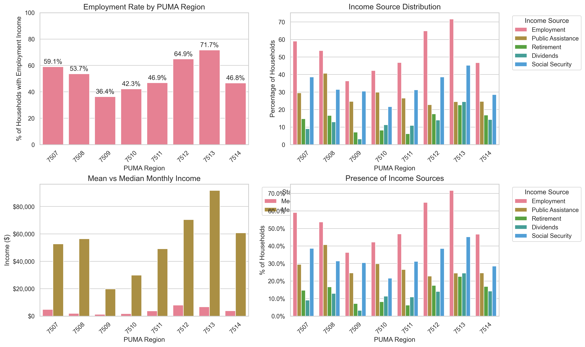
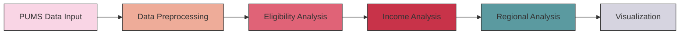

# 📊 CalWORKs Analysis for San Francisco


<div align="center">

**A comprehensive data analysis toolkit for examining CalWORKs eligibility and regional affordability across San Francisco's PUMA regions.**

[Key Findings](#-key-findings) •
[Installation](#-installation) •
[Usage](#-usage) •
[Documentation](#-documentation) •
[Contributing](#-contributing)

</div>

## 🌟 Key Features

- **Automated Eligibility Analysis**: Determine CalWORKs eligibility based on multiple criteria
- **Regional Insights**: Deep analysis of San Francisco's PUMA regions (7507-7514)
- **Income Analysis**: Multi-source income distribution and patterns
- **Housing Affordability**: Detailed rent burden analysis
- **Interactive Visualizations**: Comprehensive data visualization suite

## 📊 Installation

1. **Clone and Setup**
```bash
git clone https://github.com/pawelsloboda5/calworks-analysis.git
cd calworks-analysis
python -m venv .venv
source .venv/bin/activate  # On Windows: .venv\Scripts\activate
pip install -r requirements.txt
```

2. **Development Setup** (optional)
```bash
pip install -e ".[test]"  # Install with test dependencies
```

## 🔧 Usage

1. **Prepare Data**
- Place PUMS data files in `Script_python/data/`:
  - `hca_2022.csv` (Household data)
  - `pca_2022.csv` (Person data)

2. **Run Analysis**
```bash
python Script_python/main.py
```

3. **View Results**
- Check `output/` directory for generated analysis files
- View visualizations in `docs/images/`

## 📊 Latest Analysis Results

### Regional Overview
<table>
<tr>
<td>

<br>
<em>Comprehensive Income Analysis by PUMA Region</em>
</td>
</tr>
</table>

### Key Findings
- **Employment Patterns**:
  - Highest employment: PUMA 7513 (71.7%)
  - Lowest employment: PUMA 7509 (36.4%)
  - Regional average: ~52.8%

- **Income Distribution**:
  - Peak median income: $8,033/month (PUMA 7512)
  - Lowest median income: $1,350/month (PUMA 7509)
  - Notable income inequality in regions 7512, 7513

- **Housing Affordability**:
  - Best affordability: 24% rent-to-income (PUMA 7513)
  - Worst affordability: 93% rent-to-income (PUMA 7508)
  - Critical areas identified: PUMAs 7508, 7509

## 🎯 Project Goals

1. **Eligibility Assessment**
   - Automate CalWORKs eligibility determination
   - Identify eligible households efficiently
   - Reduce processing time and errors

2. **Regional Analysis**
   - Map income distribution patterns
   - Identify affordability hotspots
   - Track employment trends

3. **Policy Insights**
   - Support evidence-based decision making
   - Identify areas needing intervention
   - Monitor program effectiveness

## 📈 Analysis Pipeline



## 📈 Visualization Examples

<table>
<tr>
<td>

<br>
<em>Income Analysis by Region</em>
</td>
</tr>
</table>

## 🛠️ Technology Stack

- **Data Processing**: pandas, numpy
- **Statistical Analysis**: scipy
- **Visualization**: matplotlib, seaborn
- **Configuration**: PyYAML
- **Testing**: pytest, coverage

## 📖 Documentation

- [Installation Guide](docs/installation.md)
- [Data Requirements](docs/data_requirements.md)
- [Analysis Methods](docs/analysis_methods.md)
- [API Reference](docs/api_reference.md)
- [Technical Specifications](docs/technical_specifications.md)

## 🤝 Contributing

We welcome contributions! Please see our [Contributing Guidelines](CONTRIBUTING.md) for details.

1. Fork the repository
2. Create your feature branch (`git checkout -b feature/AmazingFeature`)
3. Commit your changes (`git commit -m 'Add some AmazingFeature'`)
4. Push to the branch (`git push origin feature/AmazingFeature`)
5. Open a Pull Request

## 📝 License

This project is licensed under the MIT License - see the [LICENSE](LICENSE) file for details.

## 🙏 Acknowledgments

- Data source: U.S. Census Bureau's Public Use Microdata Sample (PUMS)
- Analysis focuses on San Francisco PUMA regions: 7507-7514
- Special thanks to all contributors and maintainers

## 📧 Contact

Pawel Sloboda - [pawelsloboda5@gmail.com](mailto:pawelsloboda5@gmail.com)

Project Link: [https://github.com/pawelsloboda5/calworks-analysis](https://github.com/pawelsloboda5/calworks-analysis)

---
<div align="center">
Made with ❤️ for the San Francisco community
</div> 