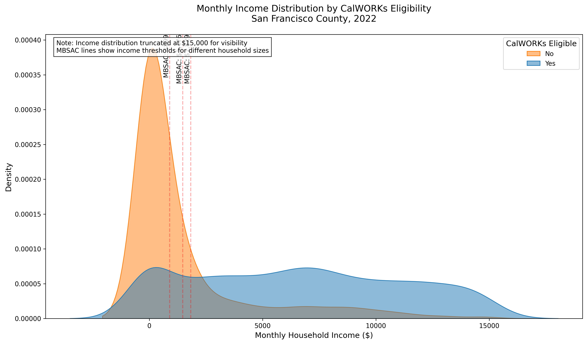
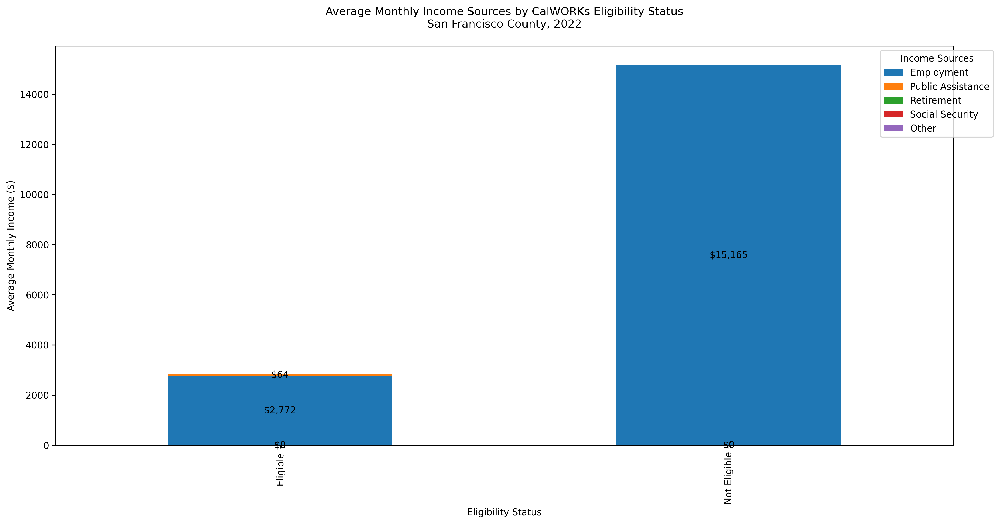
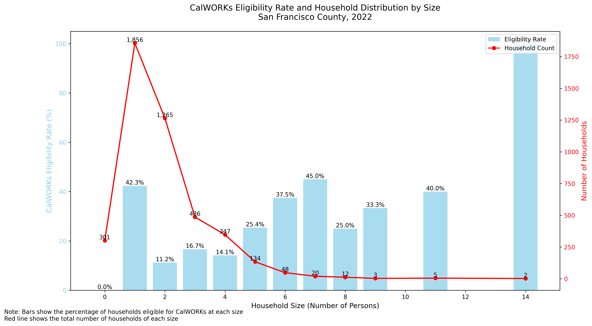
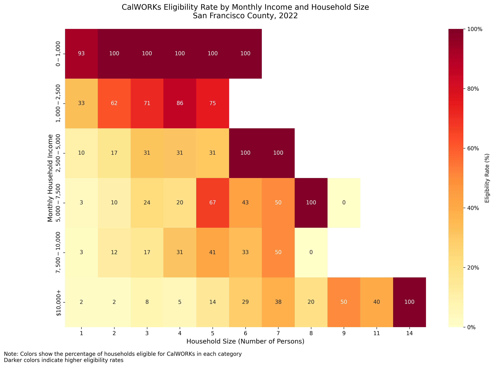
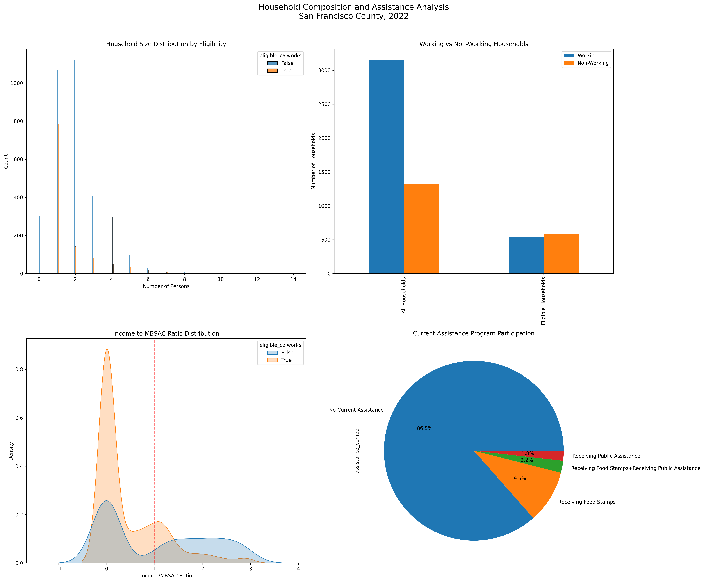

# 📊 San Francisco Housing & CalWORKs Analysis


<div align="center">

**A comprehensive analysis of housing affordability and CalWORKs eligibility across California, with focus on San Francisco's PUMA regions.**

[Overview](#-overview) • 
[State Analysis](#-state-analysis) • 
[SF Analysis](#-san-francisco-analysis) • 
[Installation](#-installation)

</div>

<div align="center">

**Documentation Links:**

- [Installation Guide](docs/installation.md)
- [Data Requirements](docs/data_requirements.md)
- [Analysis Methods](docs/analysis_methods.md)
- [API Reference](docs/api_reference.md)
- [Technical Specifications](docs/technical_specifications.md)

</div>

## 📊 Overview

Analysis execution time: 30.46 seconds

### 🔄 Comparison Metrics (SF vs State)
- Eligibility Rate Difference: -2.6%
- Median Income Ratio: 1.41
- Working Households Difference: 0.0%

## 📈 State Analysis
**Total Coverage: 167,262 households, 391,171 persons**

### Eligibility Breakdown
- Total Households: 167,262
- CalWORKs Eligible: 46,396 (27.7%)
- Income Eligible: 23.7%
- Receiving Food Stamps: 11.3%
- Receiving Public Assistance: 3.5%

### 💰 Income Metrics
- Median Monthly Income: $5,916.67
- Mean Monthly Income: $9,128.79
- Working Households: 114,635
- Average Working Members: 1.20

#### Monthly Income Distribution
- Below $1,000: 4.7%
- $1,000-$2,500: 8.6%
- $2,500-$5,000: 14.0%
- $5,000+: 55.3%

#### Income Ranges
- Minimum: -$1,366.67
- 25th Percentile: $3,750.00
- Median: $7,658.33
- 75th Percentile: $13,750.00
- Maximum: $187,250.00

#### Average Monthly Income Sources
- Public Assistance: $14.40
- Retirement: $695.40
- Interest: $646.83
- Social Security: $521.04

### 👥 Demographics
- Average Household Size: 2.34
- Household Size Distribution:
  - 1 Person: 32.5%
  - 2 Person: 27.2%
  - 3-4 Person: 25.3%
  - 5+ Person: 10.2%

### 📋 Assistance Status
- Food Stamps Recipients: 18,937
- Public Assistance Recipients: 5,884
- Average Monthly Benefits:
  - Public Assistance: $409.33
  - Food Stamps: $0.00
  - Social Security: $0.00

## 🌉 San Francisco Analysis
**Regional Coverage: 4,479 households, 8,536 persons**

### Eligibility Breakdown
- Total Households: 4,479
- CalWORKs Eligible: 1,127 (25.2%)
- Income Eligible: 23.8%
- Receiving Food Stamps: 11.7%
- Receiving Public Assistance: 4.0%

### 💰 Income Metrics
- Median Monthly Income: $8,333.33
- Mean Monthly Income: $13,910.20
- Working Households: 3,157
- Average Working Members: 1.18

#### Monthly Income Distribution
- Below $1,000: 23.2%
- $1,000-$2,500: 7.0%
- $2,500-$5,000: 8.1%
- $5,000+: 61.7%

#### Income Ranges (All Households)
- Minimum: -$458.33
- 25th Percentile: $1,250.00
- Median: $8,333.33
- 75th Percentile: $19,079.17
- Maximum: $180,416.67

#### Average Monthly Income Sources
- Public Assistance: $16.21
- Retirement: $561.26
- Interest: $943.06
- Social Security: $396.33

### 👥 Demographics
- Average Household Size: 1.91
- Household Size Distribution:
  - 1 Person: 41.4%
  - 2 Person: 28.2%
  - 3-4 Person: 18.6%
  - 5+ Person: 5.0%

### 📊 MBSAC Thresholds
- Minimum: $899.00
- Average: $1,352.34
- Maximum: $5,154.00

## 📊 Visualizations

### Income Analysis
<table>
<tr>
<td>

<br>
<em>Income Distribution by CalWORKs Eligibility</em>
</td>
<td>

<br>
<em>Income Sources Breakdown</em>
</td>
</tr>
</table>

### Eligibility Analysis
<table>
<tr>
<td>

<br>
<em>Eligibility Rates by Household Size</em>
</td>
<td>

<br>
<em>Eligibility Heatmap by Income and Household Size</em>
</td>
</tr>
</table>

### Household Composition
<table>
<tr>
<td>

<br>
<em>Comprehensive Household Composition Analysis</em>
</td>
</tr>
</table>

### Interactive Visualizations
The analysis also generates interactive Plotly visualizations:
- 📊 [Eligibility Funnel](Script_python/after_main_run_logs/20241204_092217_SF_PUMAs_7507-7514_HH167262_P391171/visualizations/plotly/eligibility_funnel.html)
- 📈 [Income Distribution](Script_python/after_main_run_logs/20241204_092217_SF_PUMAs_7507-7514_HH167262_P391171/visualizations/plotly/income_distribution.html)
- 🌳 [Household Treemap](Script_python/after_main_run_logs/20241204_092217_SF_PUMAs_7507-7514_HH167262_P391171/visualizations/plotly/household_treemap.html)
- 📉 [Risk Analysis](Script_python/after_main_run_logs/20241204_092217_SF_PUMAs_7507-7514_HH167262_P391171/visualizations/plotly/risk_analysis.html)

## ⚙️ Configuration & Customization

The analysis pipeline is highly configurable through `Script_python/config.yaml`. This allows for quick adjustments to regions, thresholds, and data paths without code changes.

### 🗺️ Regional Analysis
```yaml
regions:
  default: "san_francisco"  # Change this to analyze different regions
  definitions:
    san_francisco:
      name: "San Francisco"
      puma_codes: [7507, 7508, 7509, 7510, 7511, 7512, 7513, 7514]
      description: "San Francisco County PUMAs"
    # Add your own regions:
    # alameda:
    #   name: "Alameda County"
    #   puma_codes: [...]
```

### 💰 Income Configuration
```yaml
income:
  earned_income_disregard: 450  # Adjustable income disregard
  income_columns:
    earned: ["WAGP", "SEMP"]    # Employment income sources
    unearned: ["RETP", "INTP", "PAP", "SSP"]  # Other income sources
```

### 📊 MBSAC Thresholds
```yaml
mbsac_thresholds:
  1: 899    # 1-person household
  2: 1476   # 2-person household
  3: 1829   # 3-person household
  # ... continues
  additional_person: 308  # Amount per additional person over 10
```

### 📁 Data Paths
```yaml
paths:
  household_data: "data/hca_2022.csv"
  person_data: "data/pca_2022.csv"
  output_dir: "output"
  plots_dir: "docs/images"
```

### 🔄 Quick Region Change
To analyze a different region:

1. Add your region to `config.yaml`:
```yaml
regions:
  definitions:
    your_region:
      name: "Your Region Name"
      puma_codes: [your_puma_codes]
```

2. Update the default region:
```yaml
regions:
  default: "your_region"
```

3. Run the pipeline:
```bash
python Script_python/main.py
```

### 📋 Version Control
```yaml
pipeline:
  version: "1.1.2"
  state_code: 6  # California
```

## 🛠️ Installation & Usage

1. **Clone Repository**
```bash
git clone https://github.com/pawelsloboda5/calworks-analysis
```

2. **Setup Environment**
```bash
python -m venv .venv
source .venv/bin/activate  # On Windows: .venv\Scripts\activate
pip install -r requirements.txt
```

3. **Run Analysis**
```bash
python Script_python/main.py
```

## 📝 License

This project is licensed under the MIT License - see the [LICENSE](LICENSE) file for details.

---
<div align="center">
<strong>Supporting evidence-based housing policy in California</strong>
</div>